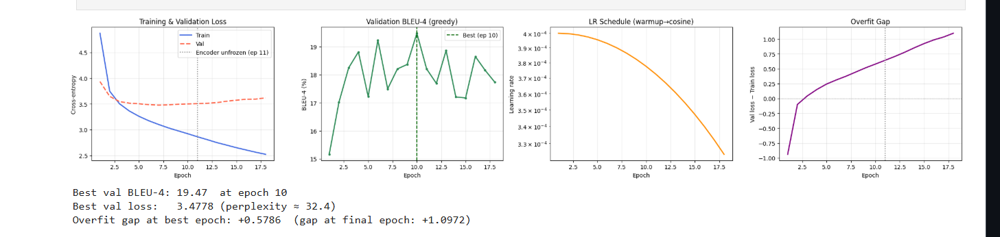
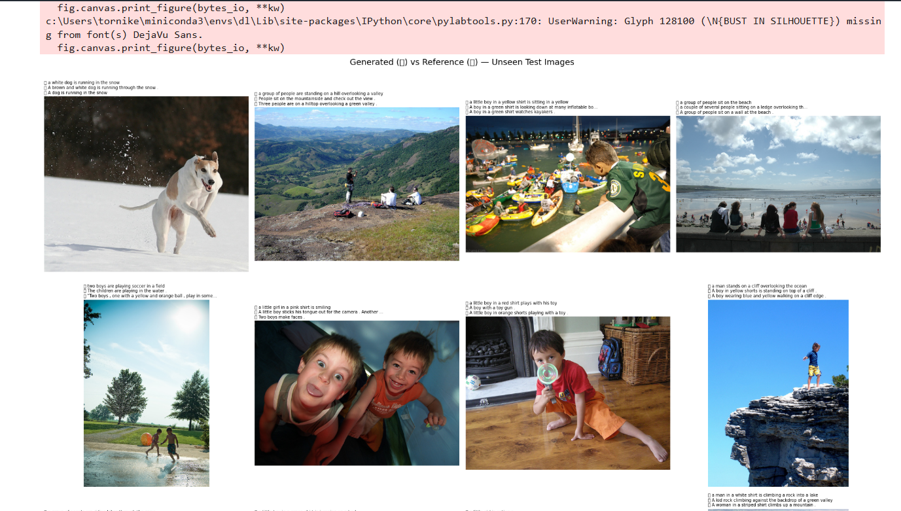
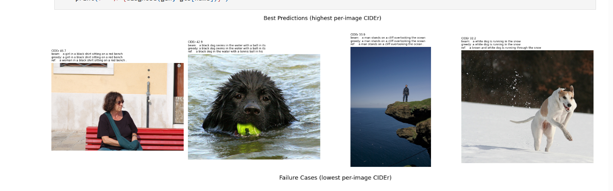
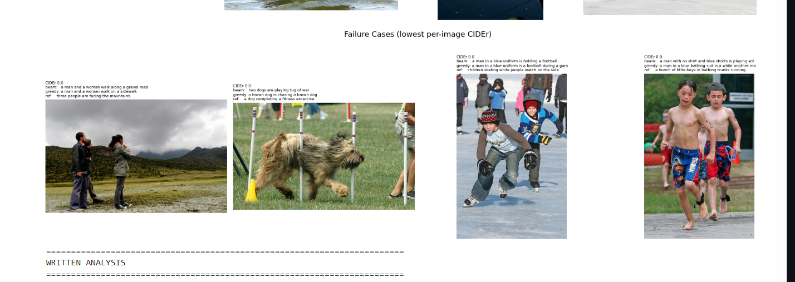

# Visual Storyteller — Image Captioning

This project implements an image captioning system that generates natural-language descriptions
for images using a CNN encoder and Transformer decoder, trained on Flickr8k-style data.

## Highlights

- CNN encoder + Transformer decoder architecture
- EfficientNet-B3 backbone (ImageNet-pretrained)
- 28.5M parameters
- Best validation BLEU-4: **19.47**
- Test BLEU-4 (beam-5): **23.58**
- Test CIDEr-D (beam-5): **5.30**
- Checkpoint selection and early stopping driven by validation BLEU-4, not loss

## Architecture


**Encoder** — EfficientNet-B3 (via `timm`, ImageNet-pretrained) with the classification head
removed. The last convolutional feature map (a 7x7 grid, 384 channels) is projected to a
512-dimensional embedding space with a linear layer, and a learned 2-D spatial position
embedding is added so the decoder's cross-attention can reason about *where* something is in the
image, rather than treating the grid as an unordered bag of features.

**Decoder** — a 4-layer Transformer decoder (8 attention heads, 2048-dim feed-forward blocks).
Each generated token attends causally to previous tokens (masked self-attention) and to the
encoder's spatial features (cross-attention). Positional information for the text stream comes
from sinusoidal encodings, and the output projection shares its weights with the input token
embedding (weight tying) — a standard regulariser that also tends to improve generation quality.

A Transformer decoder was chosen over an LSTM because it handles long-range dependencies more
gracefully, and because teacher-forced training allows parallel computation over the target
sequence rather than looping token by token — making it more computationally efficient than a
recurrent decoder on modern hardware.

## Results

Training ran for up to 60 epochs with early stopping (patience of 8 epochs on validation
BLEU-4). Best validation BLEU-4 of 19.47 was reached at epoch 10, and training stopped
automatically at epoch 18 once BLEU-4 stopped improving.



Final numbers on the sealed test set (809 images, never seen during training or checkpoint
selection):

| Metric | Greedy | Beam-5 |
|---|---|---|
| BLEU-1 | 62.44 | 64.78 |
| BLEU-2 | 44.14 | 47.29 |
| BLEU-3 | 29.80 | 33.40 |
| BLEU-4 | 19.92 | 23.58 |
| METEOR | 40.90 | 41.18 |
| CIDEr-D | 4.97 | 5.30 |

Three metrics are reported because they capture different things: BLEU is n-gram precision with
a brevity penalty (fluency and local overlap), METEOR adds stemming/synonym matching and
correlates better with human judgement, and CIDEr-D is a TF-IDF-weighted consensus score across
all five human references — the standard primary metric for captioning, since it rewards
specific, content-bearing words over generic ones. Beam search improves every metric over greedy
decoding, most noticeably on BLEU-4.

### Example predictions



Generated captions alongside human reference captions  for held-out test images.

### Qualitative analysis

Test images are ranked by per-image CIDEr score to surface the clearest successes and failures.



**What works well.** The model reliably identifies the primary subject of an image — person,
dog, crowd — and broad scene categories such as outdoor/indoor or water/grass/snow. Output is
almost always grammatically well-formed, which reflects the decoder's language-modelling
objective doing its job independently of how well it's grounding the sentence in the image.

**Where it falls short.**

1. **Overcounting** — the model often defaults to singular phrasing even when references imply
   multiple subjects, since cross-attention pools information across spatial positions rather
   than counting discrete instances.
2. **Colour and fine attributes** — colour words are occasionally dropped, though this is
   noticeably less frequent than in an earlier version that included hue jitter during training.
3. **Generic captions on complex scenes** — for unusual or busy compositions, the model tends to
   fall back on the most common pattern seen in training (e.g. "a person in a field") rather than
   capturing the specific interaction, since that generic description is a safe bet under the
   training distribution.

## Dataset

The dataset consists of 8,091 images, each paired with five human-written captions
(40,455 caption strings in total). Average caption length is 11.8 words, and 99% of captions
fall under 23 words.

The split is done at the **image level**, before anything else touches the data, so that the
five captions belonging to one image never end up in two different splits:

- Train: 6,473 images
- Validation: 809 images
- Test: 809 images (never touched until the final evaluation)

The vocabulary is built from **training captions only**, to avoid any leakage from validation or
test data into the model's token space. Words appearing fewer than 5 times are mapped to
`<UNK>`, which gave a cleaner, more fluent vocabulary of 2,663 tokens than a looser threshold.

## Design Decisions

A few choices were driven directly by how the model behaved during development rather than
picked upfront.

**Checkpoint selection by BLEU-4, not validation loss.** With label smoothing in the loss, the
lowest cross-entropy epoch is frequently *not* the epoch that produces the best captions —
cross-entropy is a poor proxy for generation quality once you're smoothing the targets. The
validation set is therefore decoded at the end of every epoch and its BLEU-4 score is tracked;
the checkpoint with the highest validation BLEU-4 is the one that gets saved, and early stopping
also watches BLEU-4 rather than loss.

**No hue jitter in augmentation.** A conventional `ColorJitter` that perturbs hue is actively
harmful for captioning: many ground-truth captions explicitly name colours ("a **red** ball",
"a man in a **blue** shirt"), and shifting hue during training teaches the model to associate the
wrong colour word with an image. Augmentation was restricted to label-preserving transformations
only — random resized crops, horizontal flips, and mild brightness/contrast jitter.

**Decoupled weight decay.** AdamW's weight decay is applied only to matrix-multiply weights;
biases, LayerNorm parameters, and embeddings are excluded, since decaying them tends to hurt
rather than help.

**Linear warmup, then cosine decay, stepped per batch.** This produced smoother training than a
cosine-with-warm-restarts schedule used in an earlier version, and pairs more predictably with
early stopping — there are no LR "bumps" partway through training that could be mistaken for a
genuine plateau in BLEU-4.

## Experiments

### First run: overfitting

An earlier configuration (encoder frozen for only 3 epochs, then the *entire* backbone unfrozen,
dropout 0.1) reached its best validation BLEU-4 at epoch 4 — the very epoch the encoder
unfroze — and then degraded for the next 8 epochs before early stopping triggered. Training loss
kept falling while validation loss climbed: a textbook case of overfitting, unsurprising when a
28-million-parameter pretrained encoder is unfrozen against only 6,473 training images.

### What changed

Rather than tweaking a single hyperparameter, the fix targeted the failure mode directly:

- The encoder freeze period was extended from 3 to 10 epochs, so a still-random decoder isn't
  pushing noisy gradients into pretrained features before it has learned anything useful to say.
- Only the **last two backbone stages** are unfrozen afterwards, not the whole encoder. Early
  convolutional layers encode generic edges and textures that don't need task-specific
  adaptation, and keeping them frozen permanently shrinks the surface available to overfit.
- The encoder's learning-rate multiplier was halved again (0.1 → 0.05), so the now-smaller
  trainable portion of the encoder adapts gently instead of chasing the decoder's larger updates.
- Dropout was raised from 0.1 to 0.2 and weight decay from 1e-2 to 3e-2, adding regularisation
  pressure appropriate for a small dataset.
- The `RandomResizedCrop` scale range was widened (0.8 → 0.65 lower bound) and `RandomErasing`
  was added — both increase effective training diversity per epoch without altering colour, so
  they don't conflict with the "no hue jitter" decision above.
- The train/validation loss gap is now plotted explicitly each run, so overfitting is visible at
  a glance rather than something to infer from a table of numbers after the fact.

### Final configuration

The results reported above come from this fixed configuration. Best validation BLEU-4 improved
and, more importantly, the model no longer degrades after the encoder unfreezes — validation
BLEU-4 rises and then plateaus cleanly, which is what triggers early stopping at epoch 18.

## Requirements

```
torch
torchvision
timm
numpy
matplotlib
pillow
tqdm
nltk
```

`timm` is a hard dependency for both notebooks — it is not allowed to fail silently into a
fallback encoder, since that would create a mismatch between the saved config and the actual
model weights and break inference. NLTK powers BLEU and METEOR; CIDEr-D is implemented locally
with no extra dependency.

## How to Run

1. Place the dataset so that `caption_data/images/` contains the `.jpg` files and
   `caption_data/captions.txt` contains the caption annotations.
2. Install the requirements above (`pip install torch torchvision timm nltk matplotlib pillow tqdm`).
3. Run `data_and_training.ipynb` top to bottom. This trains the model and writes the vocabulary,
   split file, checkpoints, training history, and plots to `artifacts/`.
4. Run `inference.ipynb` top to bottom. It loads everything from `artifacts/`, demonstrates
   `generate_caption` on unseen test images, and reproduces the evaluation tables and plots above.

Both notebooks are seeded for reproducibility, though a small amount of CUDA non-determinism is
expected and unavoidable without a meaningful training-speed cost.

## Repository Contents

| File | Purpose |
|---|---|
| `data_and_training.ipynb` | Data loading, EDA, preprocessing, model definition, and the full training loop |
| `inference.ipynb` | Loads the trained artefacts, implements `generate_caption`, and runs quantitative + qualitative evaluation on unseen test images |
| `artifacts/` | Generated by the training notebook — vocabulary, checkpoints, split file, and plots |
| `assets/` | Images used in this README |
| `README.md` | This file |


